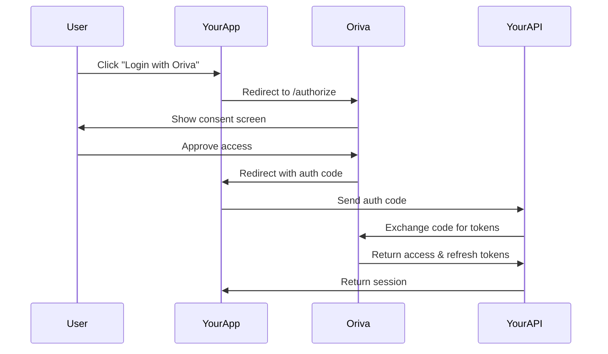

# Authentication Patterns for Oriva Platform

**Version**: 1.0.0
**Security Level**: Public Documentation

## Overview

This guide covers authentication patterns for integrating with the Oriva platform, including JWT handling, session management, and security best practices.

## Authentication Flow Options

### 1. OAuth 2.0 Flow (Recommended for Web Apps)



### 2. Direct JWT Authentication (Development/Testing)

```typescript
// For development environments only
interface JWTAuthParams {
    accessToken: string;
    userId: string;
    expiresAt: number;
}

class DirectAuthService {
    async authenticateWithJWT(params: JWTAuthParams): Promise<AuthResult> {
        // Validate JWT signature
        const isValid = await this.validateJWT(params.accessToken);

        if (!isValid) {
            throw new Error('Invalid JWT token');
        }

        // Create session
        return {
            user: {
                id: params.userId,
                token: params.accessToken
            },
            expiresAt: params.expiresAt
        };
    }

    private async validateJWT(token: string): Promise<boolean> {
        // Implement JWT validation logic
        // Check signature, expiration, and claims
        return true; // Simplified for example
    }
}
```

## Implementation Patterns

### Pattern 1: Secure Token Storage

```typescript
// services/tokenManager.ts
class TokenManager {
    private storage: Storage;
    private encryptionKey: string;

    constructor() {
        this.storage = this.getSecureStorage();
        this.encryptionKey = this.getEncryptionKey();
    }

    private getSecureStorage(): Storage {
        // Use secure storage based on platform
        if (typeof window !== 'undefined') {
            // Browser: Use sessionStorage for sensitive data
            return window.sessionStorage;
        }
        // Server: Use in-memory store or Redis
        return new InMemoryStorage();
    }

    async storeTokens(tokens: TokenSet): Promise<void> {
        const encrypted = await this.encrypt(tokens);
        this.storage.setItem('auth_tokens', encrypted);
    }

    async getTokens(): Promise<TokenSet | null> {
        const encrypted = this.storage.getItem('auth_tokens');
        if (!encrypted) return null;

        return this.decrypt(encrypted);
    }

    async clearTokens(): Promise<void> {
        this.storage.removeItem('auth_tokens');
    }

    private async encrypt(data: any): Promise<string> {
        // Implement encryption
        return JSON.stringify(data); // Simplified
    }

    private async decrypt(data: string): Promise<any> {
        // Implement decryption
        return JSON.parse(data); // Simplified
    }
}
```

### Pattern 2: Automatic Token Refresh

```typescript
// services/authRefresh.ts
class AuthRefreshService {
    private refreshTimer: NodeJS.Timeout | null = null;
    private refreshBuffer = 5 * 60 * 1000; // 5 minutes before expiry

    async setupAutoRefresh(tokenSet: TokenSet): Promise<void> {
        // Clear any existing timer
        if (this.refreshTimer) {
            clearTimeout(this.refreshTimer);
        }

        // Calculate when to refresh
        const expiresAt = tokenSet.expiresAt * 1000;
        const refreshAt = expiresAt - this.refreshBuffer;
        const delay = refreshAt - Date.now();

        if (delay > 0) {
            this.refreshTimer = setTimeout(() => {
                this.refreshToken(tokenSet.refreshToken);
            }, delay);
        }
    }

    private async refreshToken(refreshToken: string): Promise<TokenSet> {
        try {
            const response = await fetch('/api/auth/refresh', {
                method: 'POST',
                headers: {
                    'Content-Type': 'application/json'
                },
                body: JSON.stringify({ refreshToken })
            });

            if (!response.ok) {
                throw new Error('Token refresh failed');
            }

            const newTokenSet = await response.json();

            // Store new tokens
            await this.storeTokens(newTokenSet);

            // Setup next refresh
            await this.setupAutoRefresh(newTokenSet);

            return newTokenSet;
        } catch (error) {
            // Handle refresh failure
            await this.handleRefreshFailure(error);
            throw error;
        }
    }

    private async handleRefreshFailure(error: Error): Promise<void> {
        console.error('Token refresh failed:', error);
        // Clear tokens and redirect to login
        await this.clearTokens();
        window.location.href = '/login';
    }
}
```

### Pattern 3: Multi-Tenant Authentication

```typescript
// services/multiTenantAuth.ts
interface TenantContext {
    tenantId: string;
    tenantName: string;
    role: string;
    permissions: string[];
}

class MultiTenantAuthService {
    private currentTenant: TenantContext | null = null;

    async authenticateWithTenant(
        credentials: Credentials,
        tenantId: string
    ): Promise<AuthResult> {
        // Authenticate user
        const authResult = await this.authenticate(credentials);

        // Load tenant context
        const tenantContext = await this.loadTenantContext(
            authResult.userId,
            tenantId
        );

        // Validate user has access to tenant
        if (!tenantContext) {
            throw new Error('Access denied to tenant');
        }

        this.currentTenant = tenantContext;

        return {
            ...authResult,
            tenant: tenantContext
        };
    }

    async switchTenant(tenantId: string): Promise<TenantContext> {
        const userId = await this.getCurrentUserId();

        const newTenantContext = await this.loadTenantContext(
            userId,
            tenantId
        );

        if (!newTenantContext) {
            throw new Error('Cannot switch to tenant');
        }

        this.currentTenant = newTenantContext;

        // Notify app of tenant switch
        this.emitTenantSwitch(newTenantContext);

        return newTenantContext;
    }

    private async loadTenantContext(
        userId: string,
        tenantId: string
    ): Promise<TenantContext | null> {
        const response = await fetch(`/api/tenants/${tenantId}/context`, {
            headers: {
                'Authorization': `Bearer ${await this.getAccessToken()}`
            }
        });

        if (!response.ok) {
            return null;
        }

        return response.json();
    }
}
```

## Session Management

### Creating Secure Sessions

```typescript
// services/sessionManager.ts
class SessionManager {
    private sessionTimeout = 30 * 60 * 1000; // 30 minutes
    private warningTime = 5 * 60 * 1000; // 5 minutes before timeout
    private activityTimer: NodeJS.Timeout | null = null;

    async createSession(authResult: AuthResult): Promise<Session> {
        const session = {
            id: this.generateSessionId(),
            userId: authResult.userId,
            createdAt: Date.now(),
            expiresAt: Date.now() + this.sessionTimeout,
            lastActivity: Date.now()
        };

        // Store session
        await this.storeSession(session);

        // Setup activity monitoring
        this.setupActivityMonitoring(session);

        return session;
    }

    private setupActivityMonitoring(session: Session): void {
        // Monitor user activity
        const events = ['mousedown', 'keydown', 'scroll', 'touchstart'];

        events.forEach(event => {
            window.addEventListener(event, () => {
                this.updateActivity(session);
            });
        });

        // Setup session timeout warning
        this.scheduleTimeoutWarning(session);
    }

    private updateActivity(session: Session): void {
        session.lastActivity = Date.now();
        session.expiresAt = Date.now() + this.sessionTimeout;

        // Reset timeout warning
        this.scheduleTimeoutWarning(session);
    }

    private scheduleTimeoutWarning(session: Session): void {
        if (this.activityTimer) {
            clearTimeout(this.activityTimer);
        }

        const warningAt = session.expiresAt - this.warningTime;
        const delay = warningAt - Date.now();

        if (delay > 0) {
            this.activityTimer = setTimeout(() => {
                this.showTimeoutWarning(session);
            }, delay);
        }
    }

    private showTimeoutWarning(session: Session): void {
        // Show warning to user
        const remaining = Math.floor(this.warningTime / 1000 / 60);

        if (confirm(`Your session will expire in ${remaining} minutes. Stay logged in?`)) {
            this.extendSession(session);
        } else {
            this.endSession(session);
        }
    }
}
```

## Security Best Practices

### 1. CSRF Protection

```typescript
// middleware/csrf.ts
class CSRFProtection {
    generateToken(): string {
        return crypto.randomBytes(32).toString('hex');
    }

    validateToken(token: string, sessionToken: string): boolean {
        return crypto.timingSafeEqual(
            Buffer.from(token),
            Buffer.from(sessionToken)
        );
    }

    middleware() {
        return (req: Request, res: Response, next: NextFunction) => {
            if (['GET', 'HEAD', 'OPTIONS'].includes(req.method)) {
                return next();
            }

            const token = req.headers['x-csrf-token'] as string;
            const sessionToken = req.session?.csrfToken;

            if (!token || !sessionToken || !this.validateToken(token, sessionToken)) {
                return res.status(403).json({ error: 'Invalid CSRF token' });
            }

            next();
        };
    }
}
```

### 2. Rate Limiting

```typescript
// middleware/rateLimiter.ts
class RateLimiter {
    private attempts = new Map<string, number[]>();
    private maxAttempts = 5;
    private windowMs = 15 * 60 * 1000; // 15 minutes

    middleware() {
        return (req: Request, res: Response, next: NextFunction) => {
            const key = this.getKey(req);
            const now = Date.now();

            // Get attempts for this key
            const userAttempts = this.attempts.get(key) || [];

            // Filter out old attempts
            const recentAttempts = userAttempts.filter(
                timestamp => now - timestamp < this.windowMs
            );

            if (recentAttempts.length >= this.maxAttempts) {
                return res.status(429).json({
                    error: 'Too many attempts. Please try again later.'
                });
            }

            // Record this attempt
            recentAttempts.push(now);
            this.attempts.set(key, recentAttempts);

            next();
        };
    }

    private getKey(req: Request): string {
        // Use IP + user ID as key
        const ip = req.ip || 'unknown';
        const userId = req.user?.id || 'anonymous';
        return `${ip}:${userId}`;
    }
}
```

### 3. Security Headers

```typescript
// middleware/securityHeaders.ts
export function securityHeaders() {
    return (req: Request, res: Response, next: NextFunction) => {
        // Prevent XSS attacks
        res.setHeader('X-XSS-Protection', '1; mode=block');

        // Prevent clickjacking
        res.setHeader('X-Frame-Options', 'DENY');

        // Prevent MIME type sniffing
        res.setHeader('X-Content-Type-Options', 'nosniff');

        // Referrer policy
        res.setHeader('Referrer-Policy', 'strict-origin-when-cross-origin');

        // Content Security Policy
        res.setHeader(
            'Content-Security-Policy',
            "default-src 'self'; script-src 'self' 'unsafe-inline';"
        );

        // Strict Transport Security
        if (req.secure) {
            res.setHeader(
                'Strict-Transport-Security',
                'max-age=31536000; includeSubDomains'
            );
        }

        next();
    };
}
```

## Testing Authentication

### Unit Testing Auth Services

```typescript
// __tests__/auth.test.ts
describe('AuthService', () => {
    let authService: AuthService;

    beforeEach(() => {
        authService = new AuthService();
    });

    describe('authenticate', () => {
        it('should authenticate valid credentials', async () => {
            const credentials = {
                email: 'test@example.com',
                password: 'secure123'
            };

            const result = await authService.authenticate(credentials);

            expect(result).toBeDefined();
            expect(result.userId).toBeDefined();
            expect(result.accessToken).toBeDefined();
        });

        it('should reject invalid credentials', async () => {
            const credentials = {
                email: 'test@example.com',
                password: 'wrong'
            };

            await expect(authService.authenticate(credentials))
                .rejects
                .toThrow('Invalid credentials');
        });
    });

    describe('token refresh', () => {
        it('should refresh valid token', async () => {
            const refreshToken = 'valid_refresh_token';

            const result = await authService.refreshToken(refreshToken);

            expect(result.accessToken).toBeDefined();
            expect(result.expiresAt).toBeGreaterThan(Date.now());
        });
    });
});
```

## Monitoring and Logging

### Authentication Event Logging

```typescript
// services/authLogger.ts
class AuthEventLogger {
    logAuthEvent(event: AuthEvent): void {
        const logEntry = {
            timestamp: new Date().toISOString(),
            eventType: event.type,
            userId: event.userId,
            ipAddress: event.ipAddress,
            userAgent: event.userAgent,
            success: event.success,
            metadata: event.metadata
        };

        // Log to your monitoring service
        this.sendToMonitoring(logEntry);

        // Also log locally for debugging
        console.log('[AUTH]', logEntry);
    }

    private sendToMonitoring(entry: any): void {
        // Send to your monitoring service
        // e.g., Datadog, New Relic, CloudWatch
    }
}
```

## Troubleshooting Common Issues

### Issue: "Token Expired" Errors

**Solution:**
1. Implement automatic token refresh
2. Check token expiration before API calls
3. Handle 401 responses gracefully
4. Provide clear user feedback

### Issue: Session Persistence Across Tabs

**Solution:**
1. Use BroadcastChannel API for tab communication
2. Implement shared session storage
3. Sync authentication state across tabs
4. Handle concurrent refresh attempts

### Issue: Mobile App Authentication

**Solution:**
1. Use secure device storage for tokens
2. Implement biometric authentication
3. Handle app backgrounding properly
4. Use shorter token lifetimes on mobile

## Next Steps

- Review our [API Headers Reference](./api-headers-reference.md)
- Check the [API Troubleshooting Guide](./api-troubleshooting-guide.md)
- Set up [Secure Localhost Development](./SECURE-localhost-development.md)
- Review [Security Warning](./SECURITY-WARNING.md) for critical security information

---

**Security Note**: Never log or expose sensitive authentication data. Always use secure communication channels and follow OWASP guidelines.